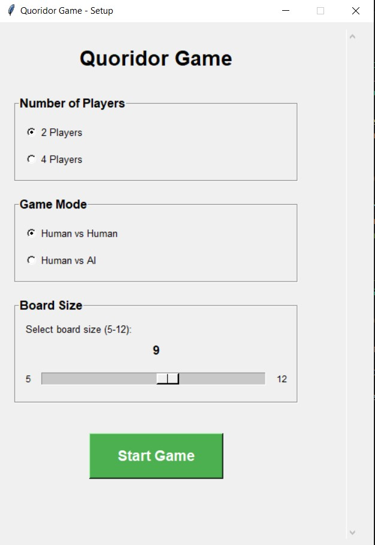
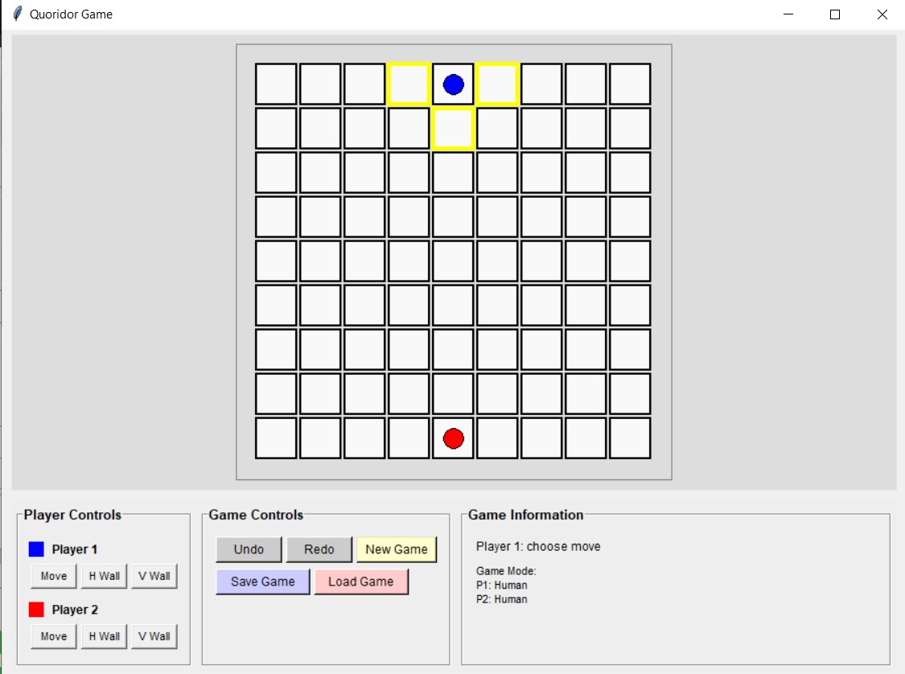
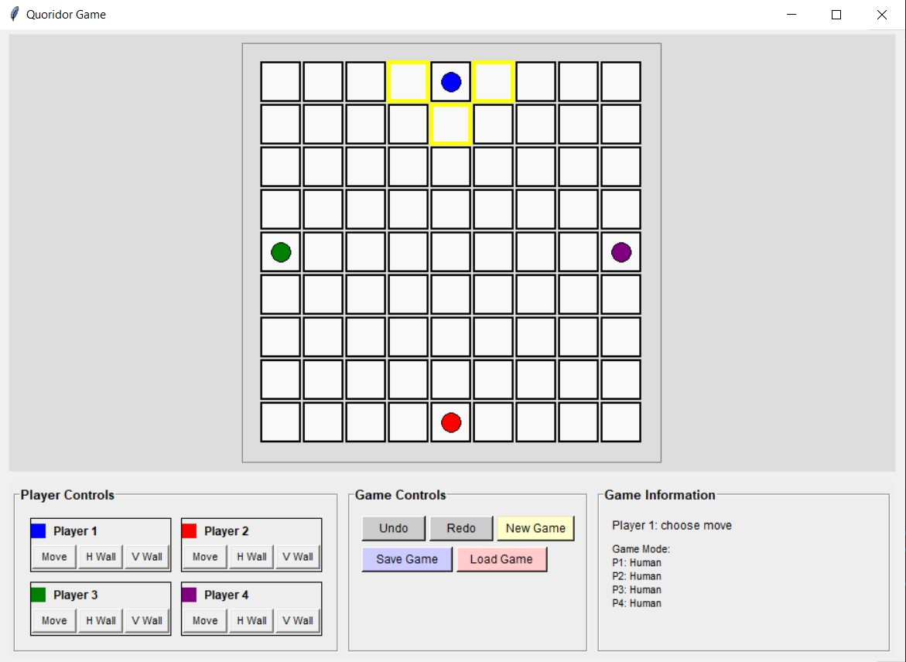

# Quoridor Game

A Python implementation of the classic board game Quoridor with AI opponents and multiple gameplay modes.

## Game Description

Quoridor is a strategic board game where players compete to be the first to reach the opposite side of the board. Players can either move their pawn or place walls to block opponents' paths. The game supports 2-4 players and features multiple AI difficulty levels.

### Features

- **2-4 Player Support**: Play with 2 or 4 players in various configurations
- **AI Opponents**: Three difficulty levels (Easy, Medium, Hard)
- **Flexible Board Sizes**: Configurable board sizes from 5x5 to 12x12
- **Save/Load System**: Save your game progress and resume later
- **Undo/Redo Functionality**: Correct mistakes with unlimited undo/redo
- **Visual Highlights**: Legal moves and wall placements are clearly highlighted
- **Cross-platform**: Runs on Windows, macOS, and Linux

## Screenshots


*Start screen showing game configuration options*


*Two-player game in progress with highlighted legal moves*



*Four-player game showing all player positions and walls*



## Installation and Running Instructions

### Prerequisites

- Python 3.7 or higher
- tkinter (usually included with Python)

### Installation

1. **Clone or download the project files**:
   - `constants.py`
   - `game_state.py`
   - `movement.py`
   - `wall_placement.py`
   - `pathfinding.py`
   - `gui.py`
   - `ai.py`
   - `start_screen.py`
   - `main.py`

2. **Run the game**:
   ```bash
   python main.py